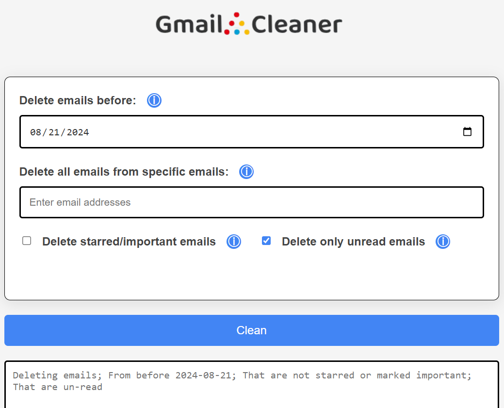

# Gmail Cleaner Web App

This is the first web app I ever made. It was made before I even attended college. With that said, I have learned a lot since the creation of this project. My code no longer looks like spagetti, is MUCH more maintainable. I just wanted to inform you before you dive into this code that this project was made when I was still a Kindergarden level developer. If you would like to see code that is more accurate to my current skill level, I have some more projects listed on this Github account. Thank you!

## Overview:

This is a web application I built with Vue.js and JavaScript. Its main purpose is to allow users to sign in with their Google account, select specific criteria for cleaning up their Gmail inbox, and start a process that goes through their gmail and deletes emails according to the selected criteria. I mainly created this to gain familiarity with vue.js, as it was my first web app, and because I wanted an easy way for my friends to clean their Gmails too. With this program I chose to delete all of my unread emails that were not marked important and this app brought the amount of emails in my inbox from 11,000+, all the way down to 78. The app is designed to be an easy way users can declutter their inbox.



## Features:

- **Google Sign-In:** Secure authentication using Google Sign-In for easy access to your Gmail account.
- **Custom Cleanup Options:** Choose from various options to select emails based on criteria such as sender, date, subject, and more.
- **Real-Time Feedback:** Provides real-time updates and feedback during the cleaning process.

## Getting Started:

### Clone the Repository:

Copy code

```
git clone https://github.com/yourusername/gmail-cleanup-webapp.git
cd gmail-cleanup-webapp
```

Install Dependencies: Ensure you have Node.js and npm installed, then run:
Copy code

```
npm install
```

## Configure Google API:

- Go to the Google Cloud Console.
- Create a new project or select an existing one.
- Enable the Gmail API.
- Create OAuth 2.0 credentials and set up a consent screen.
- You will need to add a gCloudCredentials.json to the data directory in the backend with client_id and client_secret
- In the authenticate file on the front end inside of the redirect() function you will need to add your client Id

## Start the backend server:

Cd to backend directory
`Npm start`

Start the development server:
Cd to gmail-manager directory
`npm run serve`
Open your web browser and navigate to http://localhost:8080 to view the app.

## Usage:

Sign In: Click the "Sign In" button to authenticate with your Google account.
Select Cleanup Options: Use the provided options to select emails you want to delete.
Clean Up: Click the "Clean" button to send the selected emails to the trash.

## Contributing:

Feel free to contribute to this project by submitting issues or pull requests. This was just a small project for me to better my skills at web development, I hope you find this web app useful!

## Contact:

For questions or support, please contact Jaycefo@gmail.com.
